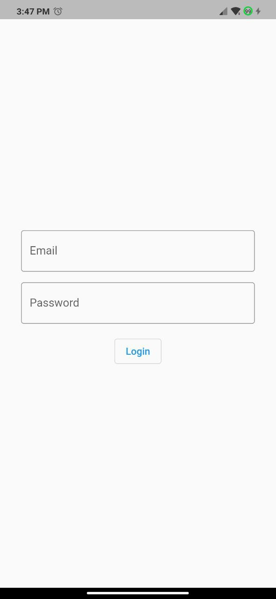
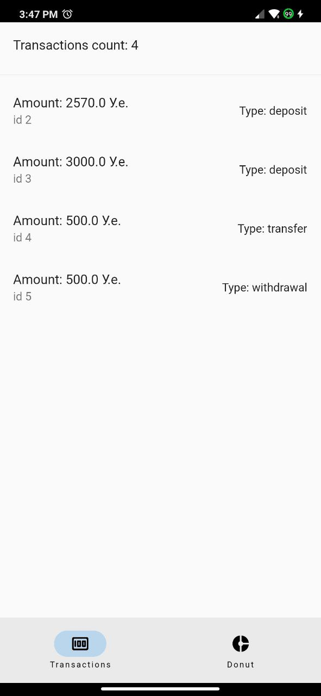
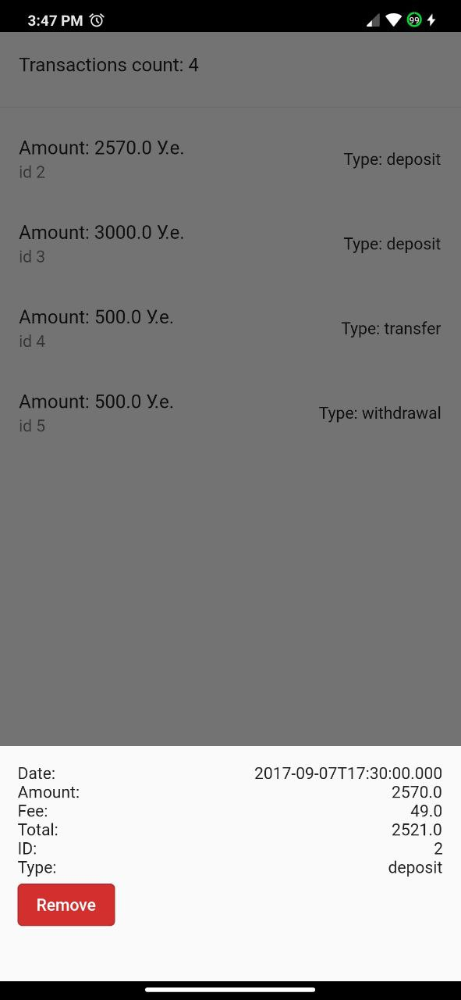
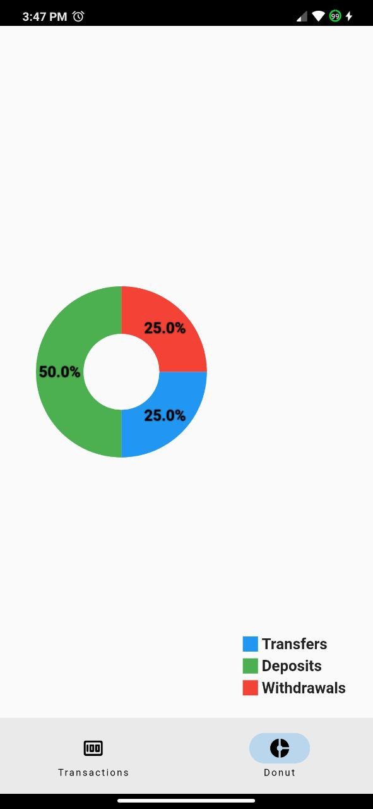

# list_of_transactions

This is a simple Flutter application to track bank transactions

## Getting Started
Get dependencies
```bash
flutter pub get
```
## Test users
| Login       | Pasword |
| ----------- | --------|
| User        | User    |

## Screenshots



